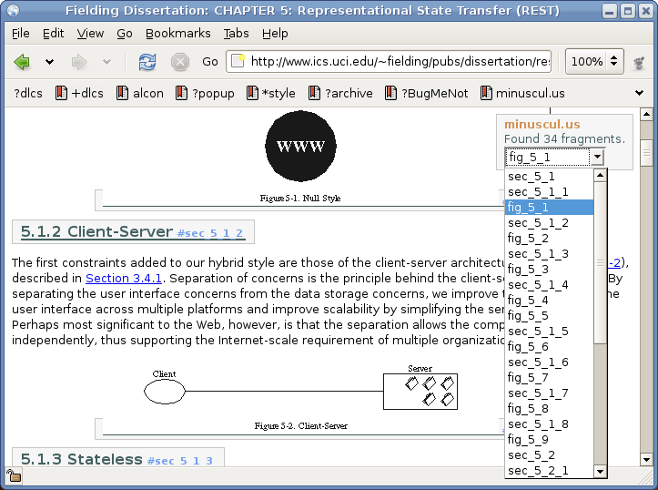

===========
minuscul.us
===========

:created: April/May 2006
:subject: web, html, tools, bookmarklets, javascript
:creator: `Berend van Berkum`_, berend@dotmpe.com
:license: MIT_
:Bookmarklet: `minuscul-us.1.bm`_
:Source:  Source_

A bookmark aid that finds and displays all the anchors in an HTML document. 
This so you can easily find the URL for a specific fragment of the page. Not
all pages provide the needed anchor ID's or names, but it works nicely for 
most text-oriented pages, fora and other sites that use comments, papers 
and eg. Wikipedia. 

Bugs
----
- Does not work (correctly) on some sites that already 
  deploy javascripts (eg. delicious).

Overview
--------

   minuscul.us running in Gnome's web browser `Epiphany`_ .

The bookmarklet displays all fragments in a drop-down select list floating
in the top-right corner. It also makes all the fragments visible and clickable. 
Subsequent bookmarklet clicks will toggle the visibility of the drop-down 
list. Reload the page to get rid of all of it. Since it is a bookmarklet 
it's nicely portable as any URL. The length (about 1800 characters) should 
cause no problem with most browsers. [1]_ 

Changelog
---------
v1
    First version, approx 1800 characters.
    

----

.. [1] http://www.squarefree.com/bookmarklets/browsers.html
.. _Epiphany: http://www.gnome.org/projects/epiphany/

.. _Source: http://dotmpe.com/project/bookmarklets/minuscul-us.latest.js
.. _MIT: http://www.opensource.org/licenses/mit-license
.. _Berend van Berkum: http://dotmpe.com/

.. .. include:: @MK_BUILDminuscul-us.bm.rst
